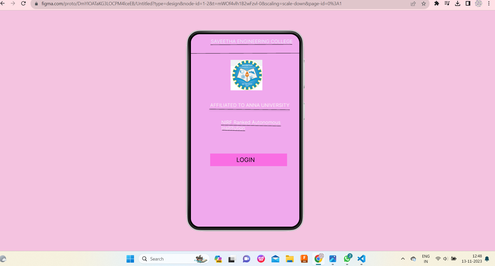
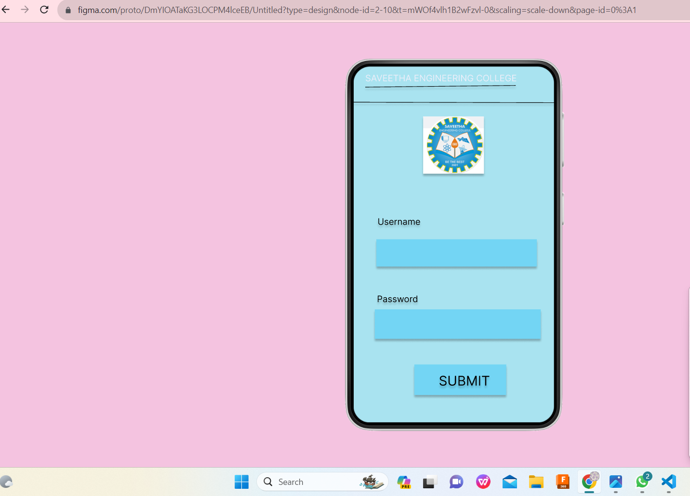
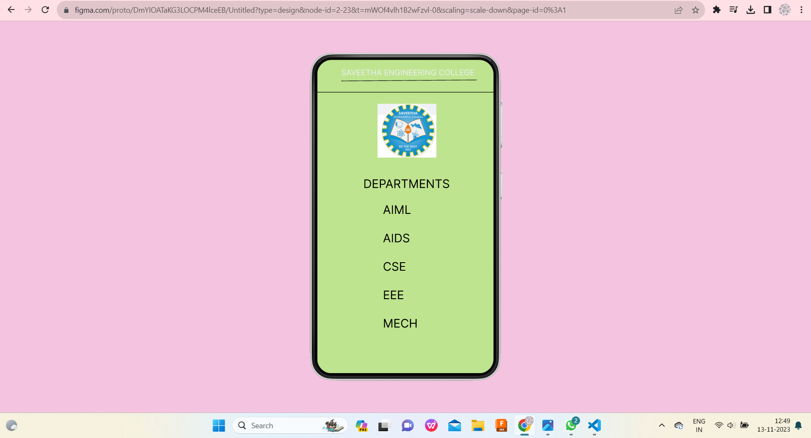

# Ex09 Event Registration Web Application
## Date:15.11.25

## AIM:
To design, develop and deploy a web application for event registration.

## DESIGN STEPS:

### Step 1:
Create a new frame.

### Step 2:
Select any one preset size of your choice.

### Step 3:
Select the shapes you need.

### Step 4:
Import images as needed.

### Step 5:
Create pages based on your need and link them.

### Step 6:

Validate the HTML and CSS code.

### Step 6:

Publish the website in the given URL.

## DESIGN TOOL:
## Home page
```
/* home page */

position: relative;
width: 360px;
height: 640px;

background: #F0A9ED;


/* SAVEETHA ENGINEERING COLLEGE */

position: absolute;
width: 294px;
height: 39px;
left: 66px;
top: 15px;

font-family: 'Inter';
font-style: normal;
font-weight: 400;
font-size: 16px;
line-height: 19px;

color: #ECEEF9;


/* Line 1 */

position: absolute;
width: 0px;
height: 0px;
left: 64px;
top: 23.5px;

border: 1px solid #000000;
transform: rotate(180deg);


/* Line 2 */

position: absolute;
width: 271px;
height: 0px;
left: 65px;
top: 36px;

border: 1px solid #000000;
transform: rotate(-0.21deg);


/* logo 1 */

position: absolute;
width: 105px;
height: 101px;
left: 132px;
top: 86px;

background: url(logo.png);


/* logo 2 */

position: absolute;
width: 105px;
height: 101px;
left: 132px;
top: 86px;

background: url(logo.png);


/* logo 3 */

position: absolute;
width: 105px;
height: 101px;
left: 132px;
top: 86px;

background: url(logo.png);


/* AFFILIATED TO ANNA UNIVERSITY */

position: absolute;
width: 296px;
height: 50px;
left: 64px;
top: 227px;

font-family: 'Inter';
font-style: normal;
font-weight: 400;
font-size: 16px;
line-height: 19px;

color: #FAF4F4;


/* Line 3 */

position: absolute;
width: 267.01px;
height: 0px;
left: 61px;
top: 250px;

border: 1px solid #000000;
box-shadow: 0px 4px 4px rgba(0, 0, 0, 0.25);
transform: rotate(0.43deg);


/* NIRF Ranked Autonomous Insititution */

position: absolute;
width: 277px;
height: 40px;
left: 101px;
top: 284px;

font-family: 'Inter';
font-style: normal;
font-weight: 400;
font-size: 16px;
line-height: 19px;

color: #F5F5F5;


/* Line 4 */

position: absolute;
width: 199.02px;
height: 0px;
left: 100px;
top: 303px;

border: 1px solid #000000;
transform: rotate(0.86deg);


/* Line 5 */

position: absolute;
width: 77.03px;
height: 0px;
left: 103px;
top: 320px;

border: 1px solid #000000;
transform: rotate(1.49deg);


/* Rectangle 1 */

position: absolute;
width: 255px;
height: 42px;
left: 64px;
top: 397px;

background: #F96EE3;


/* Rectangle 2 */

position: absolute;
width: 263px;
height: 43px;
left: 65px;
top: 474px;

background: #F0A9ED;


/* LOGIN */

position: absolute;
width: 219px;
height: 24px;
left: 151px;
top: 406px;

font-family: 'Inter';
font-style: normal;
font-weight: 400;
font-size: 20px;
line-height: 24px;

color: #000000;


/* Line 7 */

position: absolute;
width: 360px;
height: 0px;
left: 0px;
top: 65px;

border: 1px solid #000000;
transform: rotate(-0.16deg);
```
## Login page
```
/* Login page */

position: relative;
width: 360px;
height: 640px;

background: #A9E3F0;


/* SAVEETHA ENGINEERING COLLEGE */

position: absolute;
width: 332px;
height: 26px;
left: 21px;
top: 12px;

font-family: 'Inter';
font-style: normal;
font-weight: 400;
font-size: 16px;
line-height: 19px;

color: #ECEEF9;


/* Line 6 */

position: absolute;
width: 270.02px;
height: 0px;
left: 21px;
top: 38px;

border: 1px solid #000000;
box-shadow: 0px 4px 4px rgba(0, 0, 0, 0.25);
transform: rotate(-0.64deg);


/* logo 4 */

position: absolute;
width: 109px;
height: 103px;
left: 125px;
top: 90px;

background: url(logo.png);
filter: drop-shadow(0px 4px 4px rgba(0, 0, 0, 0.25));


/* Line 8 */

position: absolute;
width: 360px;
height: 0px;
left: 0px;
top: 65px;

border: 1px solid #000000;
box-shadow: 0px 4px 4px rgba(0, 0, 0, 0.25);
transform: rotate(0.16deg);


/* Rectangle 3 */

position: absolute;
width: 288px;
height: 49px;
left: 41px;
top: 311px;

background: #73D5F4;
box-shadow: 0px 4px 4px rgba(0, 0, 0, 0.25);


/* Rectangle 4 */

position: absolute;
width: 298px;
height: 53px;
left: 38px;
top: 437px;

background: #73D5F4;
box-shadow: 0px 4px 4px rgba(0, 0, 0, 0.25);


/* Rectangle 5 */

position: absolute;
width: 165px;
height: 55px;
left: 109px;
top: 536px;

background: #73D5F4;
box-shadow: 0px 4px 4px rgba(0, 0, 0, 0.25);


/* Username */

position: absolute;
width: 191px;
height: 24px;
left: 43px;
top: 270px;

font-family: 'Inter';
font-style: normal;
font-weight: 400;
font-size: 16px;
line-height: 19px;

color: #000000;

text-shadow: 0px 4px 4px rgba(0, 0, 0, 0.25);


/* Password */

position: absolute;
width: 169px;
height: 18px;
left: 42px;
top: 409px;

font-family: 'Inter';
font-style: normal;
font-weight: 400;
font-size: 16px;
line-height: 19px;

color: #000000;

text-shadow: 0px 4px 4px rgba(0, 0, 0, 0.25);


/* SUBMIT */

position: absolute;
width: 116px;
height: 26px;
left: 153px;
top: 551px;

font-family: 'Inter';
font-style: normal;
font-weight: 400;
font-size: 24px;
line-height: 29px;

color: #000000;

text-shadow: 0px 4px 4px rgba(0, 0, 0, 0.25);
```
## SEC page
```
/* SEC page */

position: relative;
width: 360px;
height: 640px;

background: #BFE48F;
box-shadow: 0px 4px 4px rgba(0, 0, 0, 0.25);


/* SAVEETHA ENGINEERING COLLEGE */

position: absolute;
width: 311px;
height: 34px;
left: 49px;
top: 17px;

font-family: 'Inter';
font-style: normal;
font-weight: 400;
font-size: 16px;
line-height: 19px;

color: #ECEEF9;


/* Line 9 */

position: absolute;
width: 277.01px;
height: 0px;
left: 49px;
top: 44px;

border: 1px solid #000000;
transform: rotate(-0.41deg);


/* Line 10 */

position: absolute;
width: 360px;
height: 0px;
left: 0px;
top: 67px;

border: 1px solid #000000;


/* logo 5 */

position: absolute;
width: 120px;
height: 110px;
left: 123px;
top: 90px;

background: url(logo.png);


/* DEPARTMENTS */

position: absolute;
width: 232px;
height: 36px;
left: 94px;
top: 239px;

font-family: 'Inter';
font-style: normal;
font-weight: 400;
font-size: 24px;
line-height: 29px;

color: #000000;


/* AIML AIDS CSE EEE MECH */

position: absolute;
width: 109px;
height: 40px;
left: 134px;
top: 292px;

font-family: 'Inter';
font-style: normal;
font-weight: 400;
font-size: 24px;
line-height: 29px;

color: #000000;
```

## OUTPUT:



## RESULT:
The program to design, develop and deploy a web application for event registration is completed successfully.
